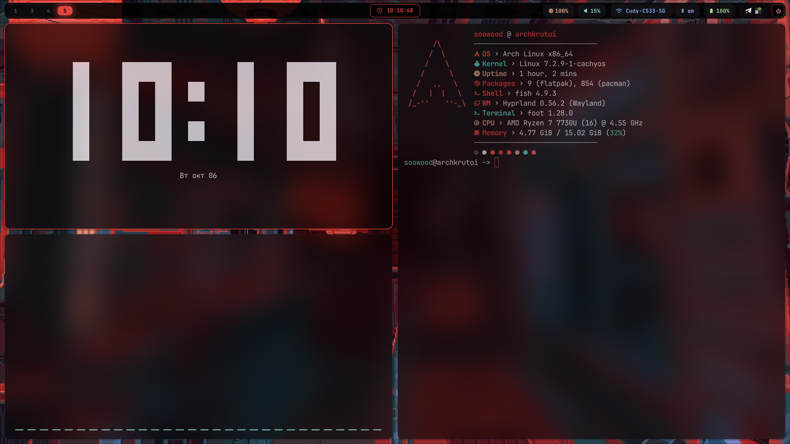
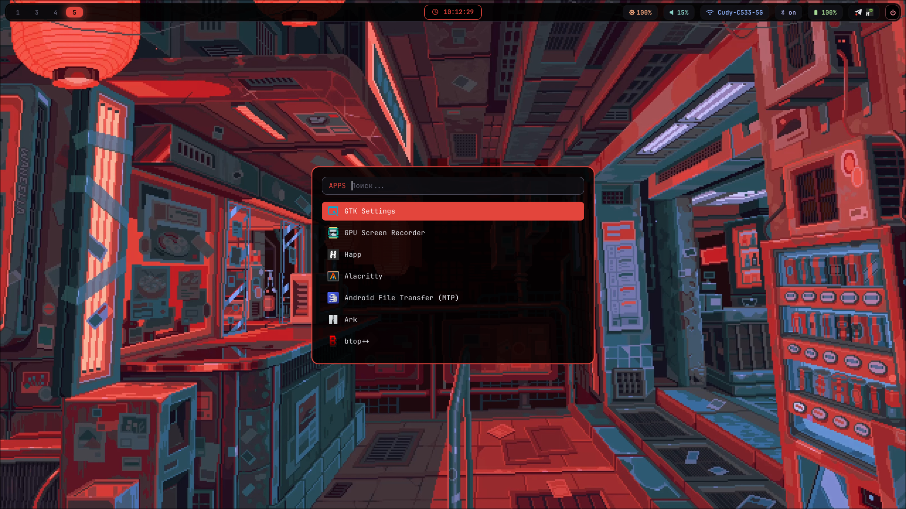
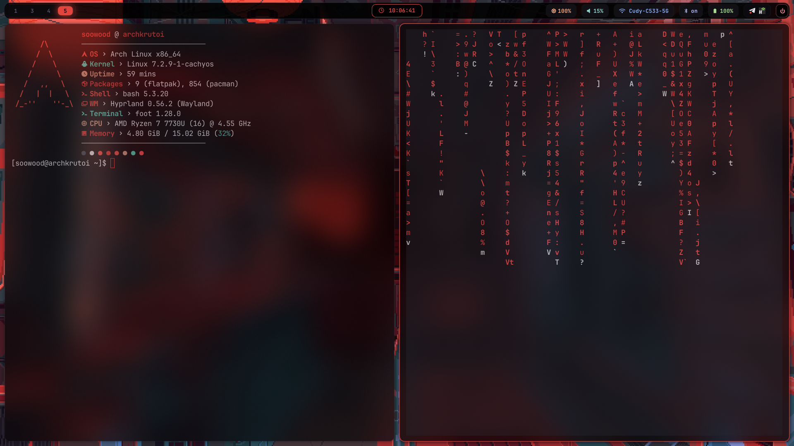
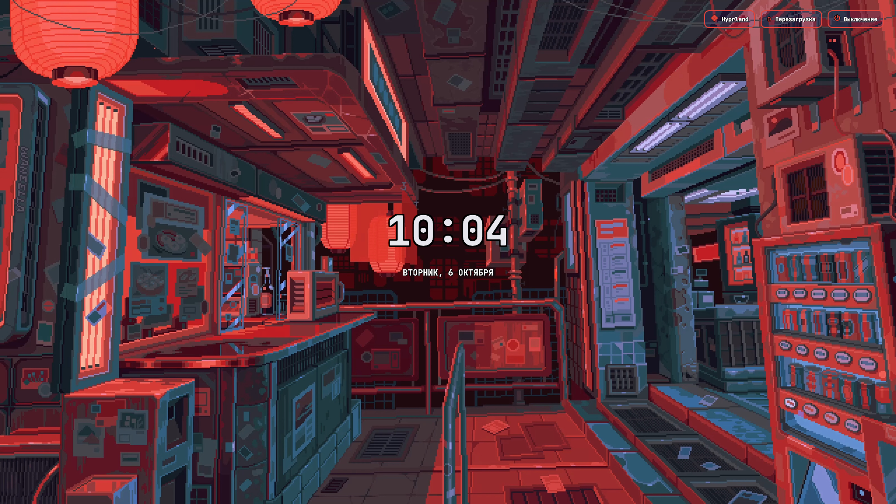
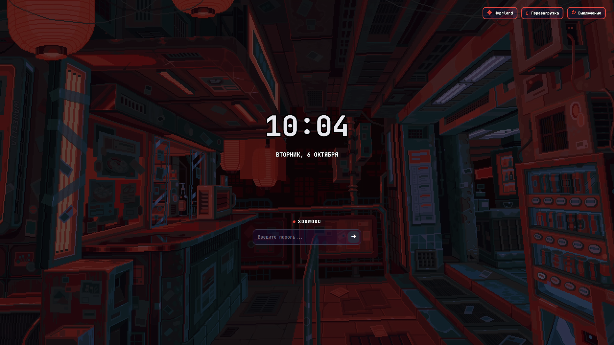

# 🌌 Hyprland Dynamic Rice + SDDM Sync Theme

Современный, динамичный конфиг **Hyprland** с автоматической синхронизацией цветовой палитры и обоев во всех приложениях и экране входа **SDDM**.



---

## 📸 Скриншоты

### Рабочий стол (Hyprland + Waybar + Foot + Cava + Fastfetch + Rofi)

| Терминалы, Часы и Cava | Меню приложений Rofi |
| :---: | :---: |
|  |  |

| Дополнительный рабочий стол (Fastfetch + cmatrix) |
| :---: |
|  |

### Экран блокировки и входа (SDDM `hypr-sync` Theme)

| Обычный режим (Часы с чёрной обводкой) | Ввод пароля (Плавное затемнение) |
| :---: | :---: |
|  |  |

---

## ✨ Особенности

- 🎨 **Динамические цвета (Pywal-style)**:
  - При смене обоев палитра автоматически извлекается из изображения через Python (`pywal_theme.py`).
  - Цвета моментально обновляются в **Hyprland** (рамки окон), **Waybar**, **Foot**, **Kitty**, **Rofi**, **Cava** и **SDDM**.
- 🖼️ **Умные обои**:
  - При запуске системы обои **не сбрасываются** на случайные, а восстанавливаются из предыдущей сессии.
  - По нажатию `SUPER + W` можно в любой момент переключить обои на случайные с плавной анимацией wipe.
- 🔐 **Блокировка экрана (Hyprlock)**:
  - Вызов по комбинации `SUPER + L`.
  - Плавное появление часов (`fadeIn`) с эстетичным GPU-блюром заднего фона (`blur_passes = 3`).
  - Минималистичный интерфейс: при вводе пароля внизу плавно появляется закруглённое поле с точками (`fade_on_empty`).
  - Разблокировка по нажатию `Enter` с плавной анимацией возврата в сессию (`fadeOut`).
- 🔒 **SDDM тема `hypr-sync`**:
  - Полностью копирует текущие обои и акцентные цвета из Hyprland.
  - Крупные минималистичные часы с **чёткой чёрной обводкой**, читаемые на любых фонах.
  - Дата на русском языке.
  - **Эффект затемнения**: при нажатии `Space` или любой клавиши для ввода пароля обои плавно затемняются, а фокус мгновенно переходит в поле ввода.
  - Кнопки управления сессией, перезагрузкой и выключением с тёмным фоном и акцентной подсветкой.
  - Динамическое имя пользователя из системы (подходит для любых ПК и мультипользовательских систем).

---

## 🚀 Быстрая установка

Склонируйте репозиторий и запустите скрипт авто-установки:

```bash
git clone https://github.com/soowood-tech/my-dotsfiles.git ~/my-dotsfiles
cd ~/my-dotsfiles
./install.sh
```

### Опции установщика:
```bash
./install.sh --no-packages   # Установить только конфиги без проверки pacman
./install.sh --no-sddm       # Не устанавливать тему SDDM
```

---

## ⌨️ Горячие клавиши

| Комбинация | Действие |
| :--- | :--- |
| **`SUPER + Enter`** | Запустить терминал (`foot`) |
| **`SUPER + R`** или **`SUPER`** | Меню приложений (`rofi`) |
| **`SUPER + L`** | **Заблокировать экран (`hyprlock`)** |
| **`SUPER + W`** | **Сменить обои и сгенерировать новую палитру** |
| **`SUPER + Q`** | Закрыть активное окно |
| **`SUPER + E`** | Файловый менеджер (`nautilus`) |
| **`SUPER + B`** | Браузер (`google-chrome`) |
| **`SUPER + V`** | Переключить плавающий режим окна |
| **`SUPER + F`** | Полноэкранный режим |
| **`SUPER + N`** | Музыкальный визуализатор (`cava`) |
| **`SUPER + X`** | Матрица (`cmatrix`) |
| **`SUPER + Shift + B`** | Монитор ресурсов (`btop`) |
| **`Print`** / **`SUPER + Shift + S`** | Скриншот области в буфер обмена |

---

## 📦 Зависимости

- **Оконный менеджер**: `hyprland`
- **Блокировка экрана**: `hyprlock`
- **Панель**: `waybar-git` (AUR) или `waybar`
- **Терминалы**: `foot`, `kitty`
- **Меню**: `rofi-wayland`
- **Обои**: `awww` (AUR) или `swww`
- **Экран входа**: `sddm`, `qt6-5compat`, `qt6-declarative`, `qt6-svg`
- **Шрифты**: `ttf-jetbrains-mono-nerd`
- **Утилиты**: `python-pillow`, `cava`, `btop`, `fastfetch`, `grim`, `slurp`, `wl-clipboard`
